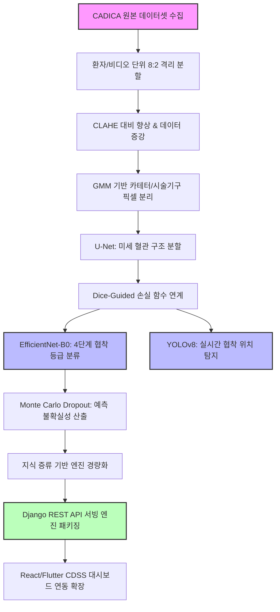

# 🫀 CADICA 데이터셋 기반 관상동맥 협착 탐지 파이프라인
> **U-Net, EfficientNet-B0, YOLOv8 기반 설명 가능한 하이브리드 AI 엔진**

본 프로젝트는 오픈소스 관상동맥 조영술(ICA) 데이터셋인 **CADICA**를 활용하여 혈관 내 협착 중등도를 4단계로 분류하고 위치를 실시간으로 탐지하는 하이브리드 딥러닝 시스템입니다. 선행 연구들의 한계점인 카테터 오진, 분지 혈관 누락, 단순 이진 분류 문제를 아키텍처 관점에서 보완하고 설명 가능성과 예측 신뢰도를 확보하는 것을 목표로 합니다.

---

## 📊 주요 차별성 요약

| 항목 | 기존 선행 연구 한계점 | **본 프로젝트 해결 방안** |
| :--- | :--- | :--- |
| **대상 혈관** | 특정 단일 혈관(RCA) 또는 3대 주혈관 중심 | **3대 관상동맥(RCA, LAD, LCx) 및 미세 분지 혈관 전체** |
| **분류 방식** | 50% 기준의 단순 이진 분류 (<50% vs ≥50%) | **4단계 중등도 세분화 분류 (Normal, Mild, Moderate, Severe)** |
| **카테터 처리** | 강제 마스킹 제거 ➔ **혈관 끊김 노이즈로 오진 유발** | **카테터 인식형 전처리 (GMM 필터) ➔ 혈관 연속성 보존** |
| **예측 신뢰도** | 블랙박스 모델 특유의 과잉 확신 위험 존재 | **Monte Carlo Dropout ➔ 정량적 신뢰도 점수 기반 판독 보류** |
| **시스템 확장** | 단순 모델 정확도 도출 및 연구 단계에서 종료 | **Django REST API 서버 구축 및 향후 CDSS 웹/앱 연동 고려** |

---

## 🛠️ 파이프라인 아키텍처 (System Workflow)

전처리부터 데이터 분리, 다중 모델 연계 및 서빙까지의 전체 흐름도입니다.

---
## 🧠 주요 구현 기술 및 방법론

### 1. 카테터 인식형 데이터 전처리 (Catheter-Aware Learning)
* 카테터를 억지로 지워 발생하는 혈관 단절 아티팩트를 방지하기 위해, **가우시안 혼합 모델(GMM) 필터링**을 적용하여 카테터와 시술 기구(Balloon, Wire) 영역을 수학적으로 인지시킵니다. 
* 기구 노이즈가 특정 클래스에 편향되지 않도록 훈련 세트에 균등하게 분배하여 모델이 기구 유무가 아닌 실제 혈관 벽 상태에 집중하도록 유도합니다.

### 2. 구조 지침 기반 XAI 고도화 (Dice-Guided Grad-CAM)
* **U-Net**이 정밀하게 추출한 혈관 마스크 영역과 **EfficientNet-B0**의 Grad-CAM 활성화 히트맵 간의 공간적 일치도(Dice Score)를 손실 함수(Loss)에 연계합니다.
* 모델이 배경 노이즈가 아닌 '실제 해부학적 혈관 영역 내 병변'만을 추적하여 진단 근거를 시각화하도록 제약 조건을 가합니다.

### 3. MC Dropout 기반 예측 불확실성 가드레일 (Uncertainty Estimation)
* 평가(Inference) 단계에서 Dropout 레이어를 활성화하여 단일 프레임에 대해 20회 반복 추론을 수행하고, 확률값의 표준편차를 통해 불확실성을 정량화합니다.
* 기대 보정 오차(ECE)를 최소화하고, 신뢰도가 낮은 애매한 프레임은 시스템이 스스로 판독을 보류하고 의료진에게 알림을 송출하는 **임상 Rejection Rule**의 기반을 마련합니다.

### 4. 지식 증류 기반 최적화 및 서빙 (MLOps)
* 복잡한 하이브리드 파이프라인의 실시간 연산 가시성을 확보하기 위해 **지식 증류(Knowledge Distillation)** 기법을 통해 모델을 경량화합니다.
* 완성된 경량화 엔진을 **Django REST API** 서버로 제품화하여 외부 React, Flutter 인터페이스 및 의료 특화 LLM(MedLM) 에이전트와 유기적으로 연동 가능한 환경을 구축합니다.

---

## 📊 평가지표 (Evaluation Metrics)

* **혈관 분할**: Dice Similarity Coefficient (DSC)
* **협착 분류 및 탐지**: Accuracy, Precision, Recall, F1-Score, ROC-AUC, Confusion Matrix, IoU
* **임상 안정성 및 시스템 효율**: Inference Time ($ms$), Expected Calibration Error (ECE)
